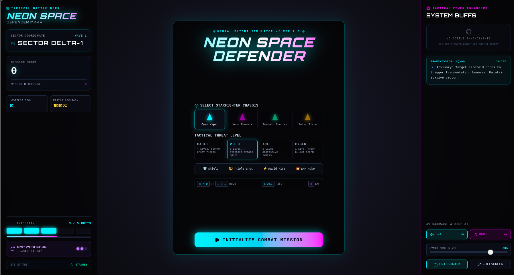
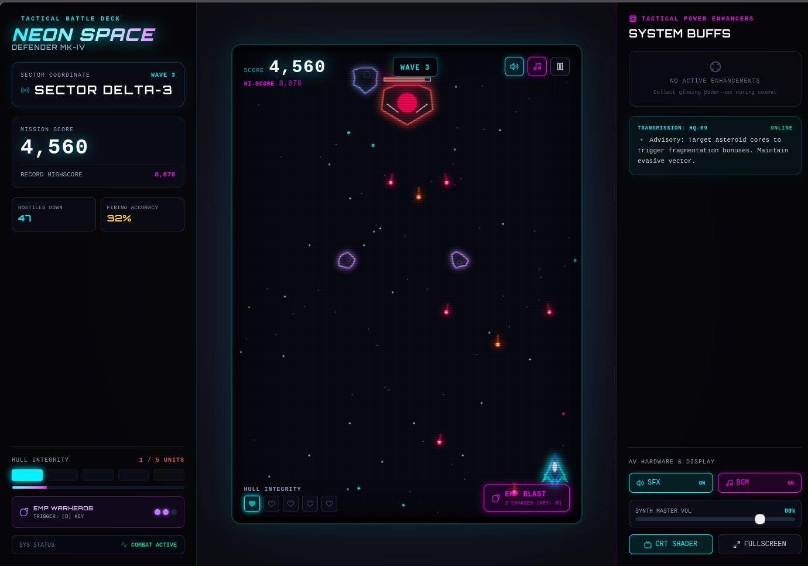

# Neon Space Defender

Neon Space Defender is a fast-paced, retro-futuristic arcade space shooter built with TypeScript, React, and Vite. Fight waves of enemies, dodge asteroids, and customize your starfighter loadout while enjoying neon visuals and synthwave audio.

Features
- Polished neon-themed HUD and visual effects
- Multiple starfighter chassis with unique traits
- Difficulty tiers (Cadet → Cyber)
- Power-ups and EMP mechanics
- Responsive virtual controls for keyboard and touch
- Built with TypeScript + React + Vite for easy local development

Live Preview
You can run the game locally (development server) — instructions below.

Quick Start (Local)
Prerequisites: `Node.js` (v16+ recommended) and `npm` or `pnpm`.

1. Clone the repo:

   `git clone <repo-url>`

2. Change into the project directory:

   `cd neon-space-defender`

3. Install dependencies:

   `npm install`

4. Start the dev server:

   `npm run dev`

5. Open your browser at `http://localhost:5173` (Vite default) to play.

Build for production

1. Build the app:

   `npm run build`

2. Preview the production build locally:

   `npm run preview`

How to Play
- Movement: `A` / `D` or Left / Right Arrow keys (also supports on-screen virtual controls)
- Fire: `Space`
- EMP / Special: `B` (or on-screen EMP button)
- Select chassis and difficulty on the start screen before initializing the mission
- Objective: Survive waves, destroy enemies and asteroids, and rack up a high score

HUD & Scoring
- Left panel: Sector coordinate, mission score, enemies down, firing accuracy, hull integrity
- Center: Game viewport and score/wave display
- Right panel: System buffs, transmissions and audio controls (SFX / BGM)

Project Structure (key files)
- `index.html` — App entry HTML
- `src/main.tsx` — React entry point
- `src/App.tsx` — Main app container and routing
- `src/components/` — UI components (HUD, modals, controls)
- `src/game/` — Game engine and entity logic
- `src/audio/soundEngine.ts` — Sound and music control
- `assets/` — Images, sprites, audio files

Development Notes
- TypeScript, React, Vite used for quick iteration and type safety.
- Use the browser DevTools for debugging rendering and input issues.

Common Commands
- Install: `npm install`
- Dev server: `npm run dev`
- Build: `npm run build`
- Preview build: `npm run preview`

Troubleshooting
- If the dev server doesn't start, ensure no other process uses port `5173`, or specify a different port with `npm run dev -- --port 3000`.
- If audio doesn't play automatically, interact with the page (click/tap) to allow audio context on some browsers.

Contributing
- Feel free to open issues or PRs to add features, fix bugs, or improve visuals and audio.
- Follow the repo style (TypeScript, React functional components) and keep changes focused.

License & Credits
- Include your preferred license here (e.g., MIT). Replace this section with the correct license and credits for any third-party assets.

Acknowledgements
- Inspired by classic arcade shooters and synthwave aesthetics.

Updated README — enjoy playing and developing Neon Space Defender!

Screenshots
Below are the gameplay screenshots. To include the images you provided, place them in the repository at `assets/screenshots/` with the filenames shown and commit them.

How to add your images
1. Create the screenshots directory (if it doesn't exist):

   `mkdir -p assets/screenshots`

2. Copy the images you attached to the conversation into the folder and name them exactly:

   `assets/screenshots/screenshot-1.png`

   `assets/screenshots/screenshot-2.png`

3. Commit the files:

   `git add assets/screenshots/screenshot-1.png assets/screenshots/screenshot-2.png`
   `git commit -m "Add gameplay screenshots to README"`

If you want, I can add the image files into the repo for you — upload them here or tell me the exact file paths on your machine and I will copy and commit them.
